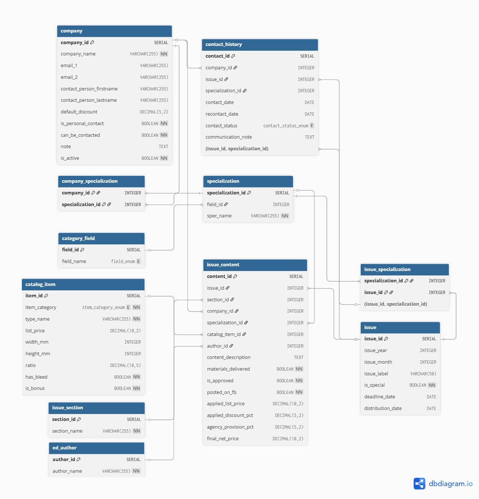
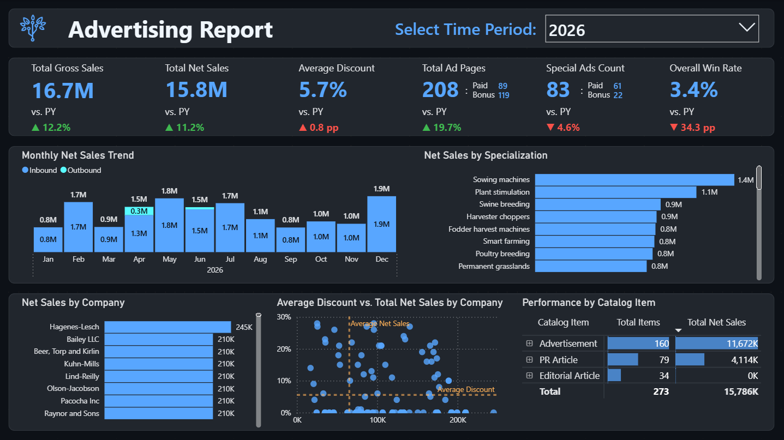
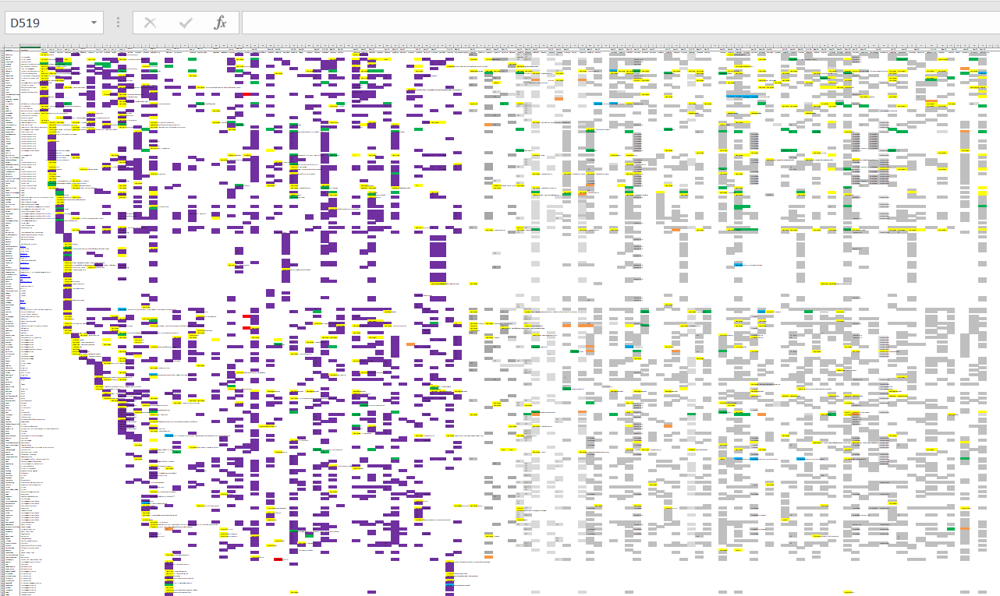

# 📂 Documentation & Visual Assets

This directory contains visual documentation and diagrams supporting the B2B Data Pipeline project. It provides a quick visual overview of the initial data state, the database architecture, and the final reporting layer.

### 🗄️ Database Architecture
* **Entity-Relationship Diagram (ERD):** A visual schema of the relational database model, detailing tables, relationships, and custom constraints. Designed using [dbdiagram.io](https://dbdiagram.io/).
*(View the image below or open the file directly)*

### 📊 Final Reporting
* **Power BI Dashboard Preview:** A static snapshot of the final interactive report. 
  * 📁 The complete `.pbix` source file is stored in the [power_bi](../power_bi/) directory.
  * 🌐 You can explore the fully interactive version of this dashboard online at [mavenshowcase.com](https://mavenshowcase.com/project/56446).

### 📉 Legacy Data State
* **Original Excel Formatting:** An illustrative screenshot showing the initial state of the raw CRM data. This highlights the specific problem of implicit metadata—demonstrating how  business statuses were encoded  using cell background colors before the ETL process.
